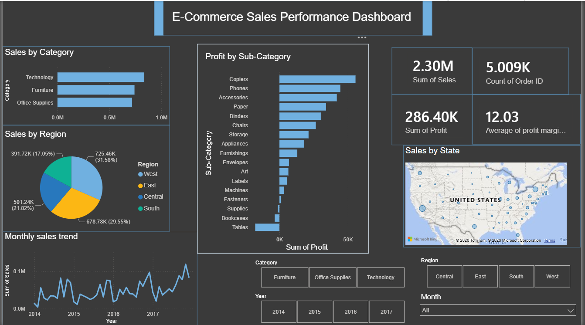

# E-commerce-sales-dashboard
E-Commerce Sales Analysis using Python and Power BI

# E-Commerce Sales Performance Dashboard

## Project Overview
Analyzed 9,994 e-commerce transactions from the Kaggle Superstore dataset to uncover sales trends, customer behavior, and product performance insights.

## Tools Used
- Python (pandas, matplotlib)
- Power BI
- Excel
- SQL

## Key Insights
- Total Revenue: $2.3M | Profit: $286K | Margin: 12%
- Technology is the highest revenue-generating category
- High discounts (40%+) consistently lead to negative profit
- Q4 (Nov-Dec) is the peak sales season every year
- West region contributes the highest sales (31.58%)

## Files
| File | Description |

| analysis.py | Python data cleaning & analysis code |
| chart1_category.png | Sales & Profit by Category |
| chart2_region.png | Sales by Region |
| chart3_monthly_trend.png | Monthly Sales Trend |
| chart4_discount_profit.png | Discount Impact on Profit |
| Ecommerce_Dashboard.pbix | Final Power BI Dashboard |
| Sample - Superstore.csv | Excel dataset |

## Dashboard Preview

## Dataset
Kaggle Superstore Dataset
